# PortraitUtils Node Suite

PortraitUtils is a suite of helper nodes for ComfyUI workflows that start with real photographs where resolutions are not standardized like they are in text-to-image generation. Nonstandard or odd resolutions may cause problems with inpainting or other workflow functions, and there may be borders or other dead space in photographs that needs to be trimmed. The suite covers cropping, fit logic, megapixel targeting, colour matching, batch I/O, and comparison QA so you can spend less time wiring utilities and more time iterating.

---

## What You Get

- **Human-aware framing** – turn noisy masks into reliable subject boxes and aspect-friendly crops.
- **Resolution helpers** – snap images to Flux whitelist sizes or match a megapixel budget without manual math.
- **Colour and tone tools** – mimic Photoshop-style auto adjustments across entire branches.
- **Workflow glue** – loaders, savers, filename utilities, and comparison gates that keep larger graphs tidy.

Every node has a matching guide under `docs/` with plain-language control explanations, quick examples, and troubleshooting tips.

---

## Install / Update

1. Copy or clone `PortraitUtils` into `ComfyUI/custom_nodes/`.
2. Restart ComfyUI (hard refresh from the manager works too).
3. Keep your existing workflows—node settings live inside the graphs you already saved.

Updating is as simple as replacing this folder and restarting.

---

## Node Guide

### Image Adjustments & Preparation

- **Auto Adjust (Levels/Tone/Color)**  
  Balance levels, tone, and colour. Mirrors Photoshop’s Auto Levels / Auto Tone / Auto Color. [Guide](docs/AutoAdjustSuite.md)  
  
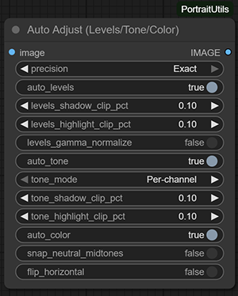

- **AutoColor Config**  
  Shares the toggle settings for Auto Adjust across your workflow. [Guide](docs/AutoAdjustSuite.md)  
  
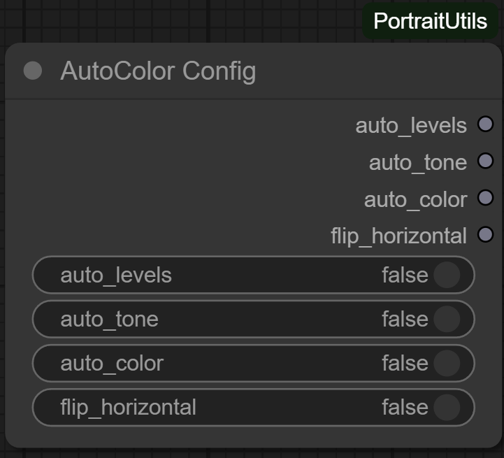

- **Auto White-Balance + Color Match**  
  Match white balance to a reference frame using quick presets. [Guide](docs/AutoWBColorMatch.md)  
  
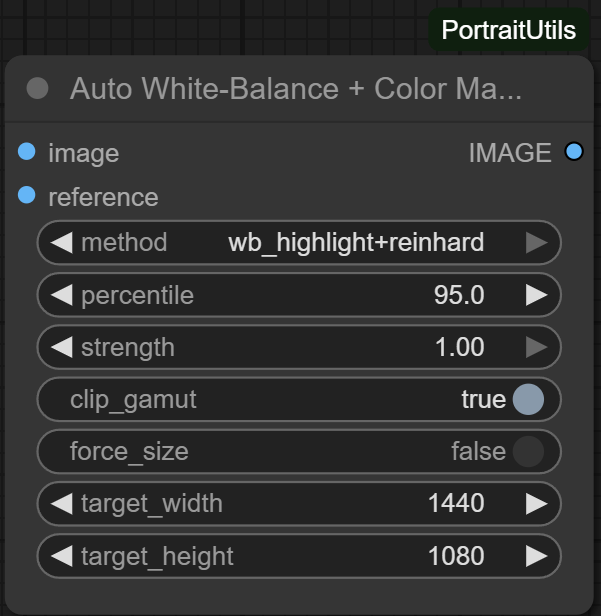

- **Flux Resolution Prepare**  
  Crop and resize to Flux-friendly dimensions with optional pre-upscale. [Guide](docs/FluxResolutionPrepare.md)  
  
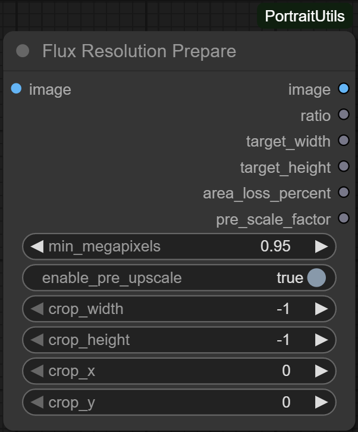

### Cropping & Framing

- **Intelligent AutoCrop (GPU)**  
  Automatically snipe away ugly black letterboxing or solid borders using your graphics card. [Guide](docs/IntelligentAutoCrop.md)  
  

- **Process Scanned Photo**  
  Automatically detect, straighten, and crop messy scanned photographs. [Guide](docs/ProcessScannedPhoto.md)  
  

- **Crop by Margins (Image)**  
  Apply precise pixel padding to your RGB images. [Guide](docs/CropByMarginsSuite.md)  
  
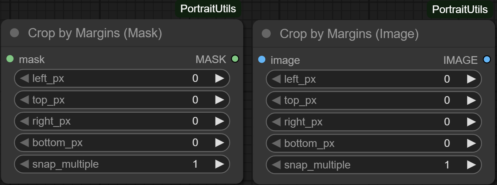

- **Crop by Margins (Mask)**  
  Apply precise pixel padding to your masks. [Guide](docs/CropByMarginsSuite.md)  
  

- **MQ BBox (MIN)**  
  Derive subject-aware crops based on noisy masks using smart quantiles. [Guide](docs/FitAspectSuite.md)  
  
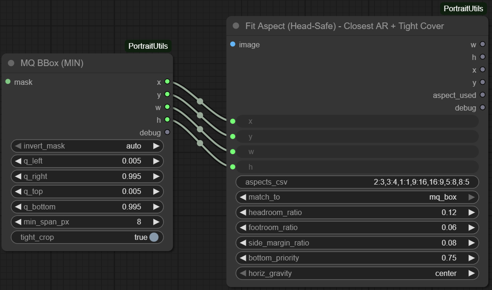

- **Fit Aspect (Head-Safe) - Closest AR + Tight Cover**  
  Snap to aspect ratios while protecting headroom and footroom. [Guide](docs/FitAspectSuite.md)  
  

- **Outpaint Padding Compute**  
  Translates your outpainting preferences into exact pixel padding values. [Guide](docs/OutpaintSuite.md)  
  
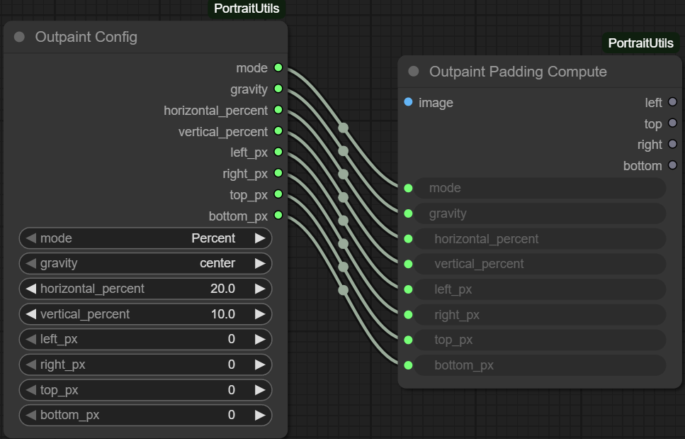

- **Stitch Two Images by Mask**  
  Blend layers together using mask-guided falloffs for seamless composites. [Guide](docs/StitchByMask.md)  
  
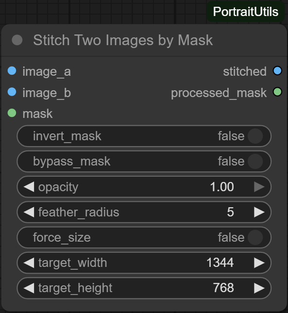

### Prompting & Configuration

- **Universal Project Config**  
  The ultimate master control board. Replaces messy spaghetti wiring with a single settings bundle! [Guide](docs/UniversalConfigSuite.md)  
  

- **Extract Config Value**  
  The wireless receiver for your Universal Config bundle. [Guide](docs/UniversalConfigSuite.md)  
  

- **Outpaint Config**  
  Store outpaint gravity and percentage preferences securely. [Guide](docs/OutpaintSuite.md)  
  

### I/O & Utilities

- **Load Image (Combined)**  
  A slick hybrid loader for grabbing single images or plowing through entire batches automatically. [Guide](docs/LoadImageCombined.md)  
  
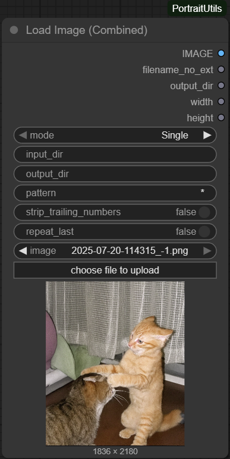

- **Paired Image Loader**  
  Pull matched before/after pairs directly from your folders for quick comparison passes. [Guide](docs/PairedImageLoader.md)  
  
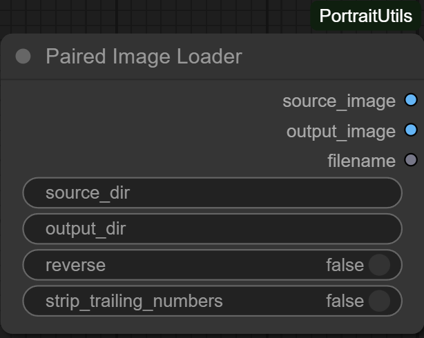

- **Simple Image Saver**  
  Save your PNGs or JPGs quickly with custom suffixes and full metadata support. [Guide](docs/SimpleImageSaver.md)  
  
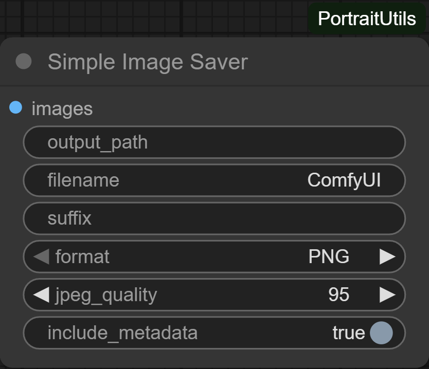

- **Filename: Append Suffix**  
  Add suffixes to your filenames safely without breaking tricky multi-part extensions. [Guide](docs/FilenameAppendSuffix.md)  
  
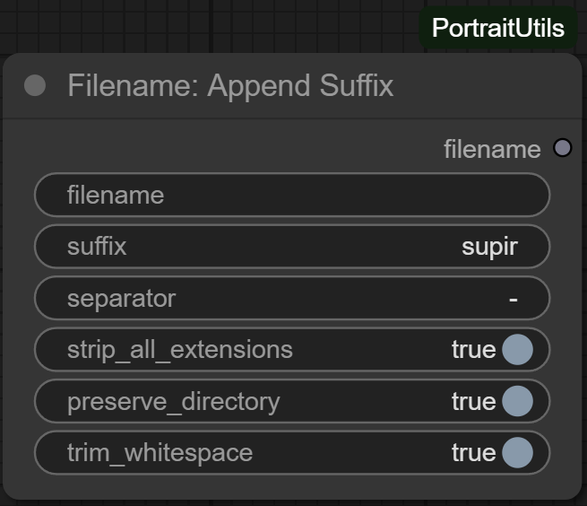

- **Comparison Gate**  
  Pauses the workflow until two incoming images are ready, ensuring they pop out at the exact same time. [Guide](docs/ComparisonGate.md)  
  
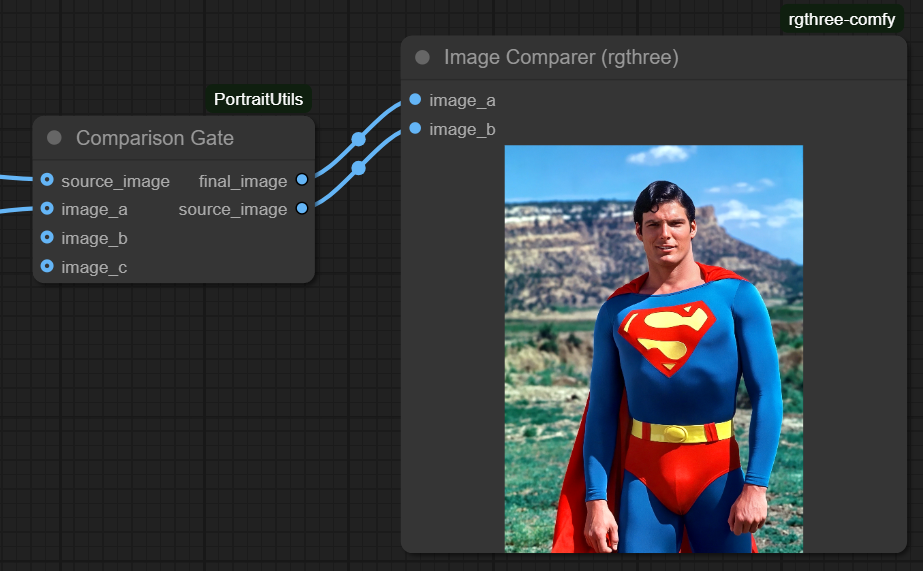

---

## Tips Before You Wire

- **Shared toggles** – drive multiple `Auto Adjust` blocks with one `AutoColor Config` when branches need the exact same look.
- **Debug strings** – cropping utilities emit detailed notes; pipe them into log widgets while tuning.
- **JSON bundles** – `Universal Project Config` emits a single string you can unpack anywhere with `Extract Config Value` to sync settings everywhere.

---

## License

GPLv3 – see [LICENSE](LICENSE).
