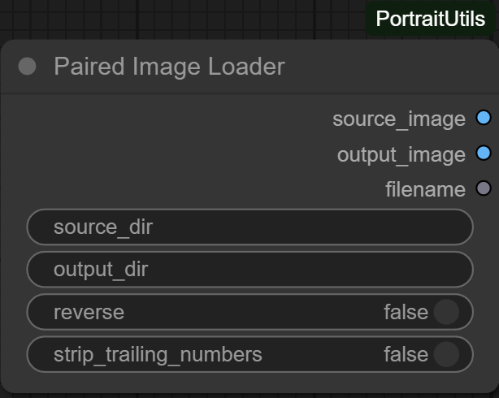
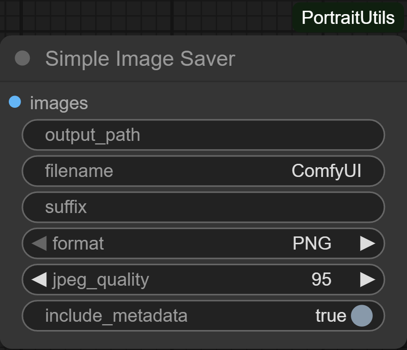
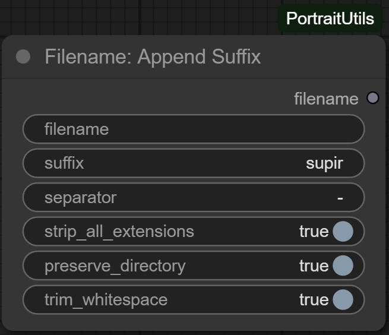
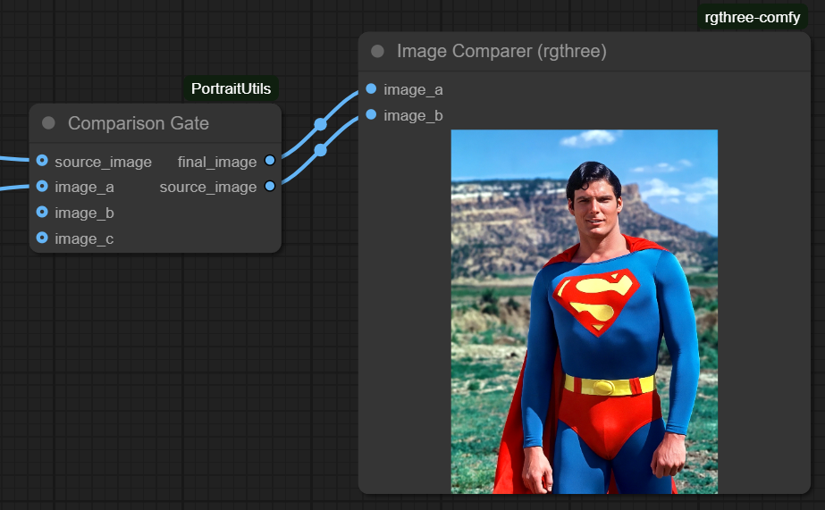
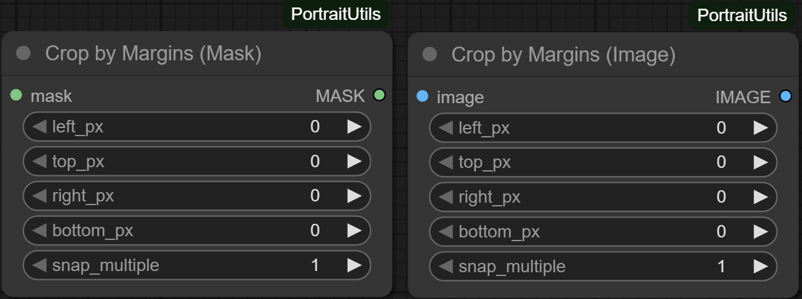
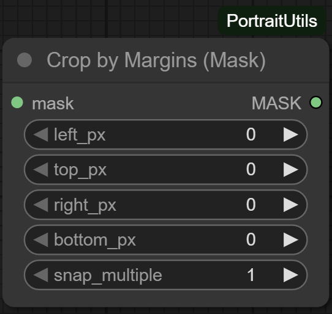
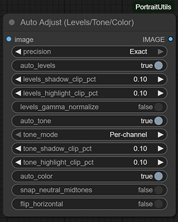
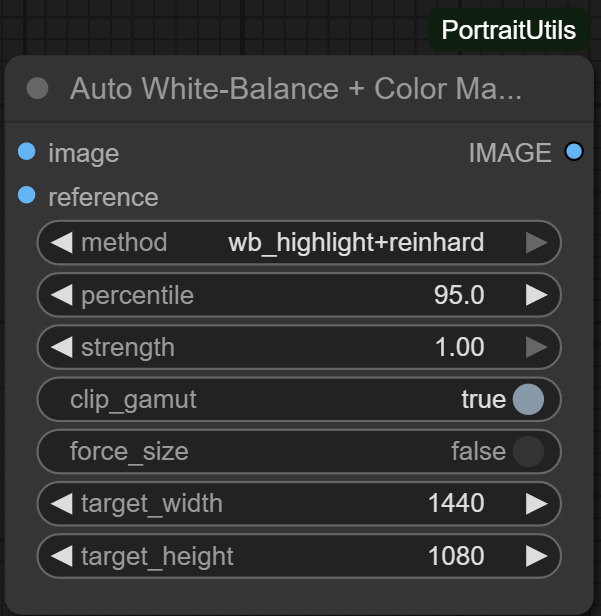
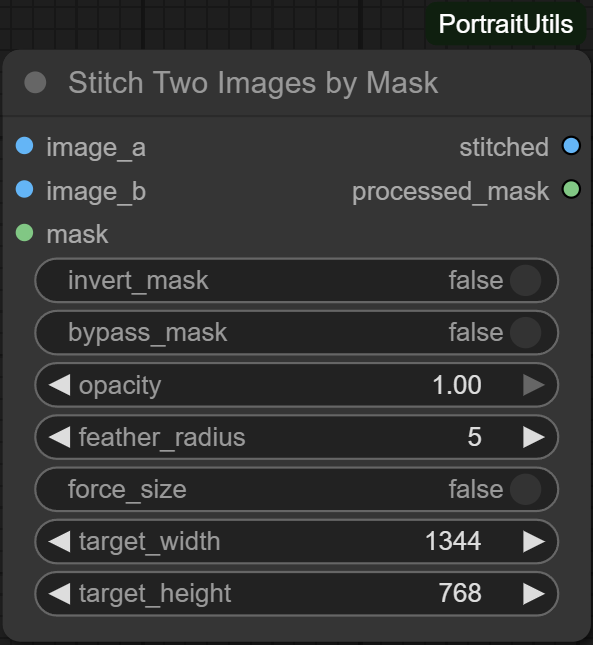
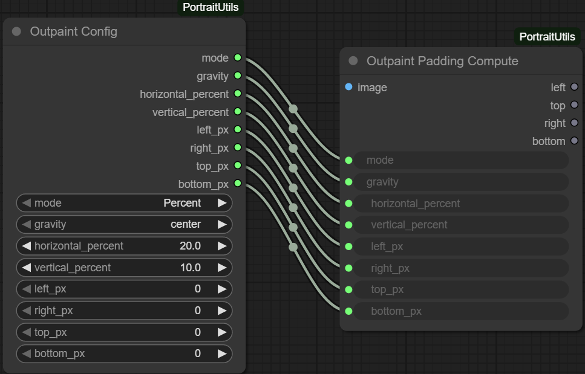

# PortraitUtils 2.0

ComfyUI utilities for editing, restoring, and finishing **real photographs**.
PortraitUtils handles subject-aware framing, editor-ready dimensions, scanned
print cleanup, tone and color correction, compositing, and image I/O. It does
not include generative models or replace your editor or upscaler.

Version **2.0.0** contains **32 nodes**, with four compact configuration bundles
and small readers that expose values only where you need them.

## What's new in 2.0

- **One Smart Photo Prepare node:** subject framing, protected-region handling,
  exact forced aspect ratios, and editor-specific resizing in one stage.
  Protected regions are respected with Smart Crop both on and off. Added canvas
  can use Black, White, or Edge extension padding.
- **Current editor targets:** Qwen Image Edit 2.1, FireRed Image Edit 1.1, and
  Flux 2 Klein Base, plus an explicit Direct / No Editor path. Qwen 2511 and
  Flux Kontext targets are retired.
- **Compact configuration:** separate crop, edit/composite, outpaint, and
  finishing bundles replace a central node with dozens of outputs. Three short
  stitch prompts can drive separate segmentation nodes.
- **Rebuilt processing:** improved loaders, solid-border detection, scanned-print
  cleanup, white balance, mask compositing, and image saving. Saves support
  atomic file publication, workflow metadata, and optional 16-bit PNG.
- **Shared engines and validation:** consistent image/mask handling, explicit
  errors, independent loader cursors, preparation diagnostics, and regression
  tests. Superseded node interfaces have been removed.

**This is a breaking release.** Read [Upgrading from 1.x](#upgrading-from-1x)
before replacing an existing installation.

## Install / Update

1. Clone this repository into `ComfyUI/custom_nodes/PortraitUtils`, or update
   your existing checkout after backing up workflows that use it.
2. Install [requirements.txt](requirements.txt) using **ComfyUI's Python
   environment**, not an unrelated system Python. For a virtual-environment
   installation, substitute your actual path:

   ```sh
   /path/to/ComfyUI/venv/bin/python -m pip install -r /path/to/ComfyUI/custom_nodes/PortraitUtils/requirements.txt
   ```

   Windows portable installations should use their bundled `python_embeded`
   interpreter instead. ComfyUI supplies the hardware-specific PyTorch build;
   this suite does not install a replacement. Use only one OpenCV wheel variant
   in that environment; see the dependency notes in `requirements.txt`.
3. Restart the **ComfyUI server**, then refresh the browser. A browser refresh
   alone does not reload Python nodes.

Python 3.10+ and a working ComfyUI installation are required. Some compressed
16-bit TIFFs additionally require the optional `imagecodecs` package; the loader
reports when it is needed. Editor models, segmentation nodes, upscalers, group
muters, and image choosers are separate installations, not suite dependencies.

## Typical wiring

```text
Load Image → Intelligent AutoCrop → Smart Photo Prepare
                                     ↓
                              Selected editor
                                     ↓
                             Editor Result Gate → Upscaler → Finish / Save
```

Generate subject/protected-region masks from the image **after border cleanup**,
and connect them to Photo Prepare on the same pixel grid. Put a Target Beacon
inside each mutually exclusive editor group; one Active Editor Target outside
those groups drives both Photo Prepare and Editor Result Gate. Only the selected
editor's decoded result passes through the gate. Direct / No Editor is an
explicit opt-in, not a fallback when an editor result is missing.

Use Photo Prepare's **`prepared_image`** for editor input. **`native_crop`** is
the original-resolution source crop **before padding or resizing**, not the
editor-ready image. The other outputs are `prepared_mask` and `prepare_info`;
local readers extract dimensions, crop coordinates, scale, or diagnostics.

| Editor target | Automatic sizing | Gate input |
| --- | --- | --- |
| Qwen Image Edit 2.1 | Dynamic, 32-aligned sizes at 1 MP, 1.5 MP, or 2K (~4 MP) | `qwen21_image` |
| FireRed Image Edit 1.1 | Approximately 1 MP presets used by its official workflow | `firered_image` |
| Flux 2 Klein Base | Dynamic, 16-aligned sizes at 1 MP or 1.5 MP | `klein_image` |

Auto (preserve detail) prefers a tier that avoids downscaling when available.
Force 1 MP is available for testing; FireRed's Force 1.5 MP is an experimental
larger output, not a documented native tier. Force 2K is Qwen 2.1 only. Forced
aspect ratios are mathematically exact with the selected editor's alignment.
The direct path retains source scale rather than selecting an editor tier.

Avoid a second crop/resize node after Photo Prepare: in particular, remove the
FireRed example's `FluxKontextImageScale` when using `prepared_image`. See the
[editor-specific wiring and sizing guide](docs/SmartPhotoPrepare.md) and
[configuration guide](docs/ConfigurationV2.md) for details.

## Node guide

Each current node has its own screenshot slot below. Existing screenshot assets
are retained in `docs/screenshots/`; placeholders mark interfaces needing a
current 2.0 capture. To fill a slot, save the named PNG there and replace the
placeholder line with the commented image markup below it. Existing displayed
screenshots use the same centered, 500-pixel-wide layout.

### Loading, saving & comparison

#### Load Image + Source Info

Single-image or auto-advancing folder loading with independent cursors, EXIF
orientation, explicit color/alpha handling, and one source-info bundle. [Guide](docs/PhotoLoaderPreview.md)

<!-- node: PortraitPhotoLoaderPreview -->
<div align="center"><em>Screenshot placeholder: <code>photo_loader_node.png</code></em></div>
<!-- <div align="center"></div> -->

#### Paired Image Loader

Load matching source/output files for before-and-after comparison, with natural
ordering and independent, transactional pair cursors. [Guide](docs/PairedImageLoader.md)

<!-- node: PortraitPairedLoaderPreview -->
<div align="center"><em>Screenshot placeholder: <code>portraitutils_paired_image_loader.png</code></em></div>
<!-- <div align="center"></div> -->

#### Simple Image Saver

Atomic PNG/JPG saves with filename suffixes, collision handling, optional workflow
metadata, 8/16-bit PNG, and a black/white JPEG alpha matte. [Guide](docs/SimpleImageSaver.md)

<!-- node: PortraitImageSaverPreview -->
<div align="center"><em>Screenshot placeholder: <code>simple_image_saver.png</code></em></div>
<!-- <div align="center"></div> -->

#### Filename: Append Suffix

Construct a filename with a configurable suffix before passing it to a saver. [Guide](docs/FilenameAppendSuffix.md)

<!-- node: FilenameAppendSuffix -->
<div align="center"></div>

#### Comparison Gate

Select a populated final/source image pair for a comparison viewer. This is a pair
selector, not an interactive pause or an editor-routing gate. [Guide](docs/ComparisonGate.md)

<!-- node: ComparisonGate -->
<div align="center"></div>

### Cropping & photo preparation

#### Intelligent AutoCrop

Remove solid borders and supported text-bearing footers, including Alamy-style
borders, before subject framing. Conservative detection and an explicit border
policy help avoid treating photographic content as a border. [Guide](docs/AutoCropPreview.md)

<!-- node: PortraitAutoCropPreview -->
<div align="center"><em>Screenshot placeholder: <code>intelligent_autocrop_node.png</code></em></div>
<!-- <div align="center"></div> -->

#### Smart Photo Prepare

Crop, pad, and resize once for the selected editor or direct-upscaler path.
Combines optional subject framing with protected regions, configured safety
margins, exact forced aspects, and editor-size selection. Four outputs keep the
node compact without losing the original source crop or diagnostics. [Guide](docs/SmartPhotoPrepare.md)

<!-- node: PortraitPhotoPrepareV2 -->
<div align="center"><em>Screenshot placeholder: <code>smart_photo_prepare_node.png</code></em></div>
<!-- <div align="center"></div> -->

#### Process Scanned Photo

Straighten a dominant scanned print and remove the white scanner bed. Choose
Scanner Bed Only to keep the print's own border, or Inner Photo Frame to also
remove a frame such as a Polaroid border. [Guide](docs/ProcessScannedPhoto.md)

<!-- node: PortraitScannedPhotoPreview -->
<div align="center"><em>Screenshot placeholder: <code>process_scanned_photo_node.png</code></em></div>
<!-- <div align="center"></div> -->

#### Crop by Margins (Image)

Trim explicit pixel margins without resizing. Optional dimension snapping trims
additional pixels from the right/bottom; this manual tool has no subject or
protected-region logic. [Guide](docs/CropByMarginsSuite.md)

<!-- node: PortraitCropImageMarginsPreview -->
<div align="center"><em>Screenshot placeholder: <code>crop_image_by_margins.png</code></em></div>
<!-- <div align="center"></div> -->

#### Crop by Margins (Mask)

Apply the same pixel-margin calculation to a mask. Use matching values on the
image and mask nodes to keep their grids aligned. [Guide](docs/CropByMarginsSuite.md)

<!-- node: PortraitCropMaskMarginsPreview -->
<div align="center"><em>Screenshot placeholder: <code>crop_mask_by_margins.png</code></em></div>
<!-- <div align="center"></div> -->

### Editor selection & routing

#### Editor Target Beacon

Declare an editor target inside a group controlled by your group muter. New
beacons default to Qwen Image Edit 2.1; set each group's target explicitly. [Guide](docs/SmartPhotoPrepare.md)

<!-- node: PortraitEditorTargetBeacon -->
<div align="center"><em>Screenshot placeholder: <code>editor_target_beacon_node.png</code></em></div>
<!-- <div align="center"></div> -->

#### Active Editor Target

Resolve the connected active beacons into one target shared by Photo Prepare and
the result gate. Keep it outside the mutually exclusive editor groups. [Guide](docs/SmartPhotoPrepare.md)

<!-- node: PortraitActiveEditorTarget -->
<div align="center"><em>Screenshot placeholder: <code>active_editor_target_node.png</code></em></div>
<!-- <div align="center"></div> -->

#### Editor Result Gate

Lazily route the selected editor's decoded IMAGE onward to the upscaler. A missing
selected result is an error; it never silently substitutes another editor or the
unedited source. [Guide](docs/SharedEngine.md#editor-result-routing)

<!-- node: PortraitEditorResultGate -->
<div align="center"><em>Screenshot placeholder: <code>editor_result_gate_node.png</code></em></div>
<!-- <div align="center"></div> -->

### Tone, color & compositing

#### Auto Adjust (Photoshop-style)

Automatic shared-channel contrast, per-channel tone, and neutral-aware color
correction, with strength and clipping controls. Follows Photoshop-style behavior;
it is not a bit-for-bit implementation of Adobe's algorithms. [Guide](docs/AutoAdjustSuite.md)

<!-- node: AutoAdjustV2 -->
<div align="center"><em>Screenshot placeholder: <code>auto_adjust_node.png</code></em></div>
<!-- <div align="center"></div> -->

#### Auto White-Balance + Color Match

Linear-light white balance and D65 Lab reference matching, with alpha-aware
statistics and optional analysis-only resizing. [Guide](docs/WhiteBalancePreview.md)

<!-- node: PortraitWhiteBalancePreview -->
<div align="center"><em>Screenshot placeholder: <code>auto_wb_color_match.png</code></em></div>
<!-- <div align="center"></div> -->

#### Stitch by Mask

Blend image versions with a mask, configured blend/stitch opacity, feathering, and
alpha-aware compositing. [Guide](docs/StitchByMask.md)

<!-- node: PortraitStitchPreview -->
<div align="center"><em>Screenshot placeholder: <code>stitch_by_mask.png</code></em></div>
<!-- <div align="center"></div> -->

#### Outpaint Padding Compute

Convert Outpaint Config and image dimensions into left/top/right/bottom pixel
padding for an external padding or outpainting node. This node computes margins;
it does not generate new image content. [Guide](docs/OutpaintSuite.md)

<!-- node: OutpaintPaddingComputeV2 -->
<div align="center"><em>Screenshot placeholder: <code>outpaint_padding_compute_node.png</code></em></div>
<!-- <div align="center"></div> -->

### Configuration

Each configuration node emits **one typed bundle**, not a separate socket for
every setting. Connect it directly to matching PortraitUtils consumers, or
use the readers below for third-party primitive inputs. Images and masks remain
separate. Set/Get nodes are optional wiring helpers, not required dependencies.

#### Input & Crop Config

Configure border cleanup first, then subject framing, resolution policy, forced
aspect ratio, subject-mask prompt, and Black/White/Edge extension padding. [Guide](docs/ConfigurationV2.md)

<!-- node: PortraitCropConfigV2 -->
<div align="center"><em>Screenshot placeholder: <code>input_crop_config_node.png</code></em></div>
<!-- <div align="center"></div> -->

#### Edit & Composite Config

Share the edit prompt, blend/stitch opacity, and three short stitch-mask prompts
without adding outputs to the configuration center. [Guide](docs/ConfigurationV2.md)

<!-- node: PortraitEditConfigV2 -->
<div align="center"><em>Screenshot placeholder: <code>edit_composite_config_node.png</code></em></div>
<!-- <div align="center"></div> -->

#### Outpaint Config

Share expansion mode, gravity, percentage/pixel margins, and the outpainting
prompt. [Guide](docs/ConfigurationV2.md)

<!-- node: PortraitOutpaintConfigV2 -->
<div align="center"><em>Screenshot placeholder: <code>outpaint_config_node.png</code></em></div>
<!-- <div align="center"></div> -->

#### Finish & Run Config

Share initial/final upscale factors, automatic adjustment switches, horizontal
flip, and the run seed. [Guide](docs/ConfigurationV2.md)

<!-- node: PortraitFinishConfigV2 -->
<div align="center"><em>Screenshot placeholder: <code>finish_run_config_node.png</code></em></div>
<!-- <div align="center"></div> -->

### Local readers

Use these small nodes next to consumers that need a STRING, INT, or FLOAT instead
of a typed bundle. They expose existing values; they do not rerun preparation.

#### Crop Prompt from Config

Read the subject-mask prompt for a segmentation node. [Guide](docs/ConfigurationV2.md)

<!-- node: PortraitCropPromptV2 -->
<div align="center"><em>Screenshot placeholder: <code>crop_prompt_reader_node.png</code></em></div>
<!-- <div align="center"></div> -->

#### Edit Prompt from Config

Select the edit prompt or one of the three stitch prompts. Use separate readers
for separate segmentation inputs. [Guide](docs/ConfigurationV2.md)

<!-- node: PortraitEditPromptV2 -->
<div align="center"><em>Screenshot placeholder: <code>edit_prompt_reader_node.png</code></em></div>
<!-- <div align="center"></div> -->

#### Outpaint Prompt from Config

Read the shared outpainting prompt as a STRING. [Guide](docs/ConfigurationV2.md)

<!-- node: PortraitOutpaintPromptV2 -->
<div align="center"><em>Screenshot placeholder: <code>outpaint_prompt_reader_node.png</code></em></div>
<!-- <div align="center"></div> -->

#### Seed from Config

Read the resolved run seed for a sampler or third-party node. [Guide](docs/ConfigurationV2.md)

<!-- node: PortraitFinishSeedV2 -->
<div align="center"><em>Screenshot placeholder: <code>seed_reader_node.png</code></em></div>
<!-- <div align="center"></div> -->

#### Scale from Config

Select the initial or final upscale factor as a FLOAT. [Guide](docs/ConfigurationV2.md)

<!-- node: PortraitFinishScaleV2 -->
<div align="center"><em>Screenshot placeholder: <code>scale_reader_node.png</code></em></div>
<!-- <div align="center"></div> -->

#### Save Info from Source

Extract the filename and output directory from the loader's source-info bundle. [Guide](docs/ConfigurationV2.md#source-metadata)

<!-- node: PortraitSourceSaveInfoV2 -->
<div align="center"><em>Screenshot placeholder: <code>save_info_reader_node.png</code></em></div>
<!-- <div align="center"></div> -->

#### Dimensions from Prepare Info

Read the prepared output width and height as INT values. [Guide](docs/SharedEngine.md#standard-preparation-node-wiring)

<!-- node: PortraitPrepareDimensionsV2 -->
<div align="center"><em>Screenshot placeholder: <code>prepare_dimensions_reader_node.png</code></em></div>
<!-- <div align="center"></div> -->

#### Crop Box from Prepare Info

Read the source-coordinate crop rectangle: x, y, width, and height. [Guide](docs/SharedEngine.md#standard-preparation-node-wiring)

<!-- node: PortraitPrepareCropBoxV2 -->
<div align="center"><em>Screenshot placeholder: <code>prepare_crop_box_reader_node.png</code></em></div>
<!-- <div align="center"></div> -->

#### Scale from Prepare Info

Read the resize factor, per-axis scale, or percentage of source pixels cropped. [Guide](docs/SharedEngine.md#standard-preparation-node-wiring)

<!-- node: PortraitPrepareScaleV2 -->
<div align="center"><em>Screenshot placeholder: <code>prepare_scale_reader_node.png</code></em></div>
<!-- <div align="center"></div> -->

#### Summary from Prepare Info

Read the resolution, selection reason, diagnostic text, or structured JSON. [Guide](docs/SharedEngine.md#standard-preparation-node-wiring)

<!-- node: PortraitPrepareSummaryV2 -->
<div align="center"><em>Screenshot placeholder: <code>prepare_summary_reader_node.png</code></em></div>
<!-- <div align="center"></div> -->

### Standalone panel utility

#### Detect & Split Photo Panels

Extract rectangular photos from a composite without resizing the source pixels.
Supports gutters, opt-in seam detection, and manual splits. Its differently sized
IMAGE list can feed a separate chooser such as Image Chooser Classic. The splitter
itself does not pause for selection or require a chooser package. [Guide](docs/PhotoPanels.md)

<!-- node: PortraitPhotoPanelSplitV2 -->
<div align="center"><em>Screenshot placeholder: <code>photo_panel_splitter_node.png</code></em></div>
<!-- <div align="center"></div> -->

## Upgrading from 1.x

Back up your workflows first. Version 2.0 removes legacy IDs rather than keeping
duplicate implementations or compatibility aliases. An older workflow may show
missing nodes until you replace them and reconnect the matching sockets.

- Replace Flux Resolution Prepare and the old Smart Crop/Prepare combinations
  with **Smart Photo Prepare** and **Input & Crop Config**.
- Replace Universal Project Config and generic config extraction with the four
  stage-specific bundles and matching readers.
- Replace superseded loader, crop, saver, white-balance, stitch, and scanned-photo
  nodes using the [retired-node map](docs/RetiredNodes.md) and
  [replacement notes](docs/ReplacementPreviews.md). Copy settings deliberately;
  swapping a JSON node ID does not migrate widget values or socket order.
- Recreate Editor Result Gate if it still shows retired sockets. Connect current
  editor outputs to `qwen21_image`, `firered_image`, and `klein_image`, and update
  the corresponding beacons. The former `qwen_image` socket has no legacy alias.
- Some production Python IDs and guide filenames still contain `Preview` for
  identification; these are the current nodes, not parallel preview versions.
  The ComfyUI display names above are the names to search for.

No workflow JSON or model weights are bundled or automatically rewritten.
Historical local workflows named `PortraitUtilsv5.2.json` use retired nodes;
`PortraitUtilsv5.3.json` also needs current editor labels and gate wiring. Neither
should be treated as an up-to-date 2.0 template without checking its connections.

## Development & release checks

Processing engines live in `core/`, separate from ComfyUI node interfaces.
Immutable configs/plans, image/mask validation, float resizing, transactional
loader state, and diagnostics are shared. See the
[architecture and contracts](docs/SharedEngine.md).

Run the regression suite using ComfyUI's Python environment:

```sh
/path/to/ComfyUI/venv/bin/python -m unittest discover -s tests -v
git diff --check
```

Tests cover decoding and loader sequencing, borders and scans, tone/color math,
compositing, metadata and concurrent saves, protected framing and padding,
panel splitting, typed readers, editor routing, and the complete node registry.
These are utility/contract tests, not a substitute for end-to-end GPU tests of
your chosen editor and upscaler.

Before publishing, include all new runtime modules, `core/`, documentation, and
tests in the release commit. Keep dependencies in `pyproject.toml` and
`requirements.txt` synchronized. Replace screenshot placeholders as captures
become available; editor recovery files and patch backups are ignored.

The existing [publish action](.github/workflows/publish.yml) publishes to Comfy
Registry when a push to `main` or `master` changes `pyproject.toml`, or when
manually dispatched. A local version bump alone does not publish a release.

## License

GPLv3 — see [LICENSE](LICENSE).
