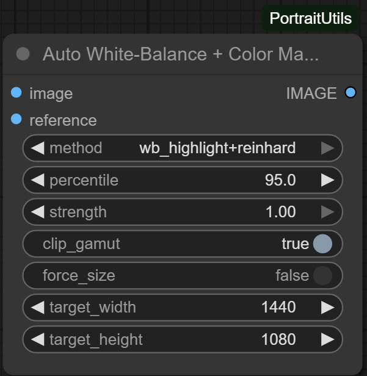
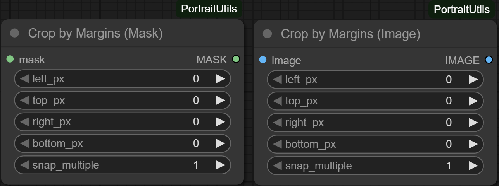
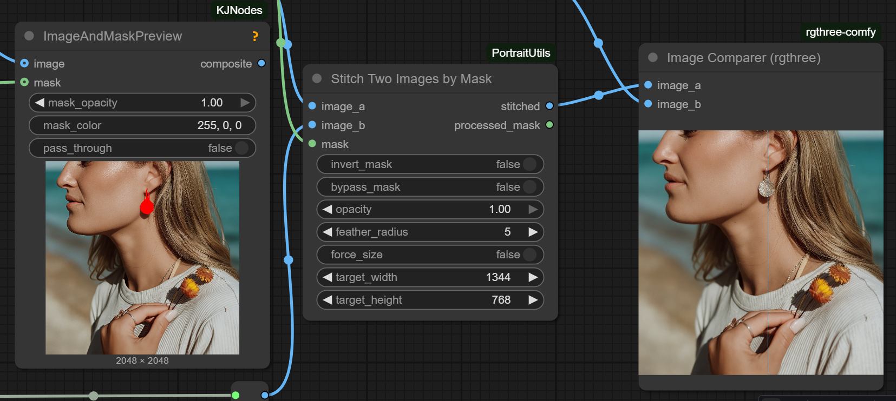

# PortraitUtils Node Suite

PortraitUtils is a focused collection of ComfyUI nodes designed for pipelines using real potographic images of people, where image sizes are not standardized as they are in text-to-image generation. The suite streamlines prep work such as cropping, resolution targeting, metadata management, and side-by-side QA so you can concentrate on creative iteration instead of utility wiring. These nodes should work well on any type of image, but some of them are designed for and tested on images of humans, particularly the smart cropping nodes.

## Node Index

Each entry links to a short, task-oriented reference page (coming soon) for deeper usage notes and parameter breakdowns.

### Image Adjustments & Preparation
- `AutoAdjustNode` + `AutoColorConfigNode` - Global tone balancing with reusable toggle bundles. [Docs](docs/AutoAdjustSuite.md)
  

- `AutoWBColorMatch` - White-balances and colour matches against a reference image using several algorithms. [Docs](docs/AutoWBColorMatch.md)
  

- `FluxResolutionPrepare` - Crops and resizes to the nearest Flux-friendly resolution, with optional pre-upscale. [Docs](docs/FluxResolutionPrepare.md)
  

- `ImageMegapixelSelector` - Chooses image sizes by target megapixels to match downstream model limits. [Docs](docs/ImageMegapixelSelector.md)
  

### Cropping, Framing, and Stitching
- `AutoCropBorders` - Removes uniform borders using adaptive fuzzy detection. GPU acceleration is currently broken, so leave that off for now. [Docs](docs/AutoCropBorders.md)
  

- `CropImageByMargins` + `CropMaskByMargins` - Aligned margin croppers for RGB images and masks. [Docs](docs/CropByMarginsSuite.md)
  

- `FitAspectHeadSafe` + `MQBBoxMin` - Subject-aware boxing with headroom-aware aspect fitting. [Docs](docs/FitAspectSuite.md)
  

- `StitchByMask` - Composites foreground and background images using mask-driven blending. [Docs](docs/StitchByMask.md)
  

### Prompting & Workflow Configuration
- `MultiPromptNode` - Cycles through prompt variants with per-slot weights. [Docs](docs/MultiPromptNode.md)
  

- `WorkflowConfig` - Centralized key/value store for workflow-wide settings. [Docs](docs/WorkflowConfig.md)
  

- `OutpaintConfigNode` + `OutpaintPaddingComputeNode` - Preference capture plus per-edge padding conversion. [Docs](docs/OutpaintSuite.md)
  

### I/O & Utility Helpers
- `LoadImageCombined` - Hybrid single/batch image loader with auto-advance support. [Docs](docs/LoadImageCombined.md)
  

- `PairedImageLoader` - Loads synchronized source/output pairs for A/B comparison workflows. [Docs](docs/PairedImageLoader.md)
  

- `ComparisonGate` - Gates comparison outputs until two populated images are available. [Docs](docs/ComparisonGate.md)
- `SimpleImageSaver` - Minimal saver with PNG/JPG, metadata toggle, and filename suffix controls. [Docs](docs/SimpleImageSaver.md)
  

- `FilenameAppendSuffix` - Adds suffixes to filenames while respecting multi-extension cases. [Docs](docs/FilenameAppendSuffix.md)
  

- `GpuSyncCacheClear` - Forces a CUDA sync and empties selected caches to avoid VRAM buildup. [Docs](docs/GpuSyncCacheClear.md)
  

- `SeedVR2Prep` - Convenience helper for SeedVR2/VRAM-heavy pipelines (cache priming & cleanup). [Docs](docs/SeedVR2Prep.md)
  

## License

This project is released under the [MIT License](LICENSE).
