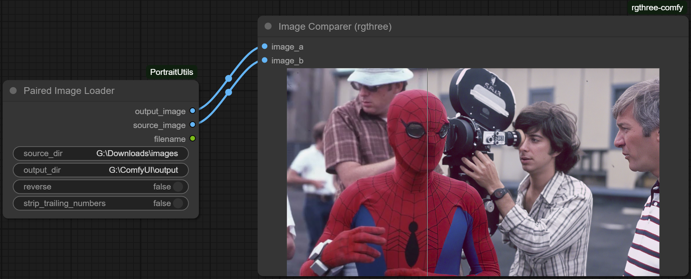
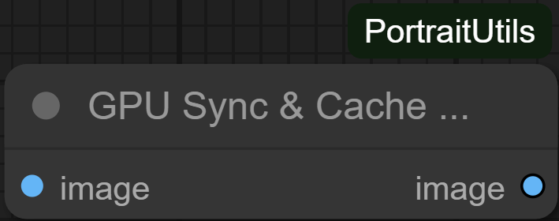

# PortraitUtils Node Suite

PortraitUtils is a suite of helper nodes for ComfyUI workflows that start with real photographs where resolutions are not standardized like they are in text-to-image generation. Nonstandard or odd resolutions may cause problems with inpainting or other workflow functions, and there may be borders or other dead space in photographs that needs to be trimmed. The suite covers cropping, fit logic, megapixel targeting, colour matching, batch I/O, and comparison QA so you can spend less time wiring utilities and more time iterating.

---

## What You Get

- **Human-aware framing** – turn noisy masks into reliable subject boxes and aspect-friendly crops.
- **Resolution helpers** – snap images to Flux whitelist sizes or match a megapixel budget without manual math.
- **Colour and tone tools** – mimic Photoshop-style auto adjustments across entire branches.
- **Workflow glue** – loaders, savers, filename utilities, and comparison gates that keep larger graphs tidy.

Every node has a matching guide under `docs/` with plain-language control explanations, quick examples, and troubleshooting tips.

---

## Install / Update

1. Copy or clone `PortraitUtils` into `ComfyUI/custom_nodes/`.
2. Restart ComfyUI (hard refresh from the manager works too).
3. Keep your existing workflows—node settings live inside the graphs you already saved.

Updating is as simple as replacing this folder and restarting.

---

## Node Guide

### Image Adjustments & Preparation
- **AutoAdjustNode + AutoColorConfigNode**  
  Balance levels, tone, and colour. AutoAdjust mirrors Photoshop’s Auto Levels / Auto Tone / Auto Color, while AutoColorConfig shares those toggles across branches. [Guide](docs/AutoAdjustSuite.md)  
  

- **AutoWBColorMatch**  
  Match white balance to a reference frame using quick presets. [Guide](docs/AutoWBColorMatch.md)  
  

- **FluxResolutionPrepare**  
  Crop and resize to Flux-friendly dimensions with optional pre-upscale. [Guide](docs/FluxResolutionPrepare.md)  
  

- **ImageMegapixelSelector**  
  Hit a target megapixel count to fit downstream memory limits. [Guide](docs/ImageMegapixelSelector.md)  
  

### Cropping & Framing
- **AutoCropBorders**  
  Remove letterbox or scanner borders with CPU/GPU options. [Guide](docs/AutoCropBorders.md)  
  

- **StripBottomBanner**  
  Detect and trim dark metadata banners that sit against the bottom frame so your downstream crops only see the photo content. [Guide](docs/StripBottomBanner.md)  
  

- **StripSolidBorders**  
  Peel away large flat-colour frames common in legacy scan/BBS collections, with iterative passes and logo-aware thresholds for multi-step borders. [Guide](docs/StripSolidBorders.md)  
  

- **CropImageByMargins / CropMaskByMargins**  
  Apply matching padding to RGB images and masks. [Guide](docs/CropByMarginsSuite.md)  
  

- **MQBBoxMin + FitAspectHeadSafe**  
  Derive subject-aware crops with controllable headroom. [Guide](docs/FitAspectSuite.md)  
  

- **StitchByMask**  
  Blend layers with mask-guided falloff for composites. [Guide](docs/StitchByMask.md)  
  

### Prompting & Configuration
- **MultiPromptNode**  
  Rotate through prompt variants with per-slot weights. [Guide](docs/MultiPromptNode.md)  
  

- **WorkflowConfig**  
  Centralise run parameters, presets, and notes; outputs both sockets and a JSON bundle. [Guide](docs/WorkflowConfig.md)  
  

- **OutpaintConfigNode + OutpaintPaddingComputeNode**  
  Store outpaint preferences and convert them to pixel padding per edge. [Guide](docs/OutpaintSuite.md)  
  

### I/O & Utilities
- **LoadImageCombined**  
  Hybrid single/batch loader with auto-advance support. [Guide](docs/LoadImageCombined.md)  
  

- **PairedImageLoader**  
  Pull matched before/after pairs for QA passes. [Guide](docs/PairedImageLoader.md)  
  

- **ComparisonGate**  
  Hold viewers until you have two images-no more half renders. [Guide](docs/ComparisonGate.md)  
  

- **SimpleImageSaver**  
  Save PNG/JPG with metadata and suffix controls. [Guide](docs/SimpleImageSaver.md)  
  

- **FilenameAppendSuffix**  
  Append suffixes without breaking multi-part extensions. [Guide](docs/FilenameAppendSuffix.md)  
  

- **GpuSyncCacheClear**  
  Flush CUDA caches mid-run to avoid VRAM creep. [Guide](docs/GpuSyncCacheClear.md)  
  

- **SeedVR2Prep**  
  Prep heavy SeedVR2 pipelines with cache priming and cleanup. [Guide](docs/SeedVR2Prep.md)  
  

Screenshots under `docs/screenshots/` match the ComfyUI widgets so you can confirm you grabbed the right node.

---

## Tips Before You Wire

- **Shared toggles** – drive multiple `AutoAdjustNode` blocks with one `AutoColorConfigNode` when branches need the same look.
- **Debug strings** – cropping utilities (`MQBBoxMin`, `FitAspectHeadSafe`, `FluxResolutionPrepare`) emit detailed notes; pipe them into log widgets while tuning.
- **JSON bundles** – `WorkflowConfig` emits a single string you can unpack in custom scripts to sync settings everywhere.
- **GPU switches** – nodes like `AutoCropBorders` and `GpuSyncCacheClear` expose `use_gpu`; flip them based on the machine you run on.

---

## Terminology Refresh

- **Bundle** – JSON string from `WorkflowConfig` that carries current settings.
- **Quantile crop** – `MQBBoxMin` trims mask outliers by percentile; tweak the `q_*` sliders when masks are noisy.
- **Area loss** – `FluxResolutionPrepare` reports how much of the working image gets trimmed to hit a Flux aspect.

---

## License

MIT – see [LICENSE](LICENSE).
