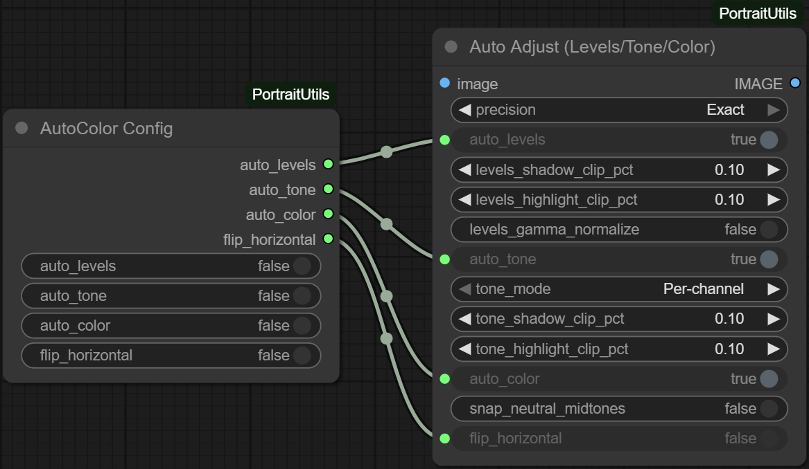

# AutoColorConfigNode

## Overview
`AutoColorConfigNode` bundles the toggle values used by `AutoAdjustNode` into a reusable configuration socket. It is designed to keep multiple processing branches in sync without duplicating widgets, and it emits plain boolean values that can be re-injected into other nodes.

## Inputs
- `auto_levels` (`BOOLEAN`, default `False`): Desired state for the levels stage.
- `auto_tone` (`BOOLEAN`, default `False`): Desired state for the tone stage.
- `auto_color` (`BOOLEAN`, default `False`): Desired state for the colour balance stage.
- `flip_horizontal` (`BOOLEAN`, default `False`): Indicates whether downstream nodes should flip their outputs horizontally.

## Outputs
- `auto_levels` (`BOOLEAN`)
- `auto_tone` (`BOOLEAN`)
- `auto_color` (`BOOLEAN`)
- `flip_horizontal` (`BOOLEAN`)

## Usage Notes
- Route the outputs directly into the corresponding sockets on one or more `AutoAdjustNode` instances.
- Because all outputs are plain booleans, the node is safe to use with ComfyUI’s conditional routing or scripting nodes.
- The node stores no internal state; toggling any widget simply passes the value straight through.*** End Patch
