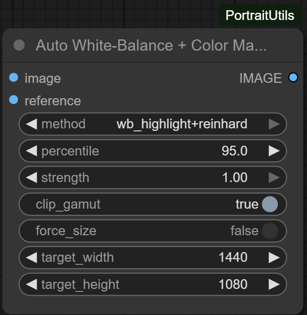

# AutoWBColorMatch

## Overview
`AutoWBColorMatch` aligns an image’s white balance and global colour characteristics to match a reference. Multiple strategies are available: gray-world and highlight-based white balance, full or luminance-only Reinhard colour transfer in Lab space, or a hybrid pipeline that combines highlight balancing with Reinhard matching.

## Inputs
- `image` (`IMAGE`): Source image tensor `[B, H, W, C]`. Alpha channels are discarded.
- `reference` (`IMAGE`): Target look that the source should emulate.
- `method` (`STRING`, default `"wb_highlight+reinhard"`):
  - `wb_grayworld` – scales channels so the global mean becomes neutral grey.
  - `wb_highlight` – computes gains from the brightest pixels.
  - `reinhard_lab` – matches full Lab mean/std to the reference.
  - `lab_l_only` – matches only the L component in Lab space.
  - `wb_highlight+reinhard` – performs highlight white balance first, then full Reinhard matching.
- `percentile` (`FLOAT`, default `95.0`): Percentile used by the highlight detector when `wb_highlight` is involved (range `80.0–99.9`).
- `strength` (`FLOAT`, default `1.0`): Blends between the original (`0.0`) and fully matched result (`1.0`).
- `clip_gamut` (`BOOLEAN`, default `True`): Clamps the final output to `[0, 1]` after blending.
- `force_size` (`BOOLEAN`, default `False`): When `True`, resizes both images to the supplied `target_width`/`target_height` before computing statistics, then resizes the matched output back to the original resolution.
- `target_width`, `target_height` (`INT`, defaults `1440×1080`): Working resolution used when `force_size` is enabled.

## Outputs
- `IMAGE`: RGB tensor after white balance and colour matching, blended according to `strength`.

## Processing Notes
- Colour conversions follow the sRGB ↔ linear ↔ XYZ ↔ Lab pipeline with D65 white point constants.
- Highlight-based white balance uses a quantile mask to estimate channel gains, clamping them between 0.5 and 2.0 to avoid extreme corrections.
- Reinhard matching calculates per-image mean and standard deviation in Lab space; `lab_l_only` preserves chroma while adjusting luminance.
- When `force_size` is active, corrections occur at the specified working resolution for improved speed and comparability; the result is then resampled back to match the original dimensions.

## Tips
- Use `wb_highlight+reinhard` to neutralise both colour casts and overall contrast in a single step.
- Dial down `strength` to keep some of the original styling when the reference is only a loose guide.
- Disable `clip_gamut` if you plan to perform additional tone mapping afterward and want to preserve unclamped intermediate values.*** End Patch
