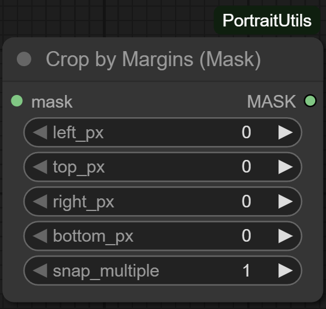

# CropMaskByMargins

## Overview
`CropMaskByMargins` mirrors the behaviour of `CropImageByMargins` but operates on mask tensors. It normalises mask shapes into `[B, H, W, 1]`, applies pixel margins, and optionally snaps the result to a given multiple—ideal for keeping mask geometry aligned with cropped images.

## Inputs
- `mask` (`MASK`): Accepts `[H, W]`, `[H, W, 1]`, `[1, H, W]`, or `[B, H, W, 1]`. Values are converted to float32 in `[0, 1]`.
- `left_px` (`INT`, default `0`): Pixels to remove from the left edge.
- `top_px` (`INT`, default `0`): Pixels to remove from the top edge.
- `right_px` (`INT`, default `0`): Pixels to remove from the right edge.
- `bottom_px` (`INT`, default `0`): Pixels to remove from the bottom edge.
- `snap_multiple` (`INT`, default `1`): Optional modulus applied to width/height after cropping (see the image variant for details).

## Outputs
- `MASK`: Cropped mask tensor (same batch size as the normalised input).

## Processing Notes
- Shape coercion covers common mask formats generated by ComfyUI widgets and scripts; unsupported layouts raise a descriptive `ValueError`.
- Margins are clamped so that the crop stays within bounds and retains at least a 1×1 area.
- Snapping uses the same helper as the image node, ensuring both outputs remain in lockstep when identical parameters are used.

## Tips
- Always route the same margin values to both image and mask versions when preparing composites.
- Set `snap_multiple` to `8` or `16` before feeding masks into latent-space operations that expect even dimensions.*** End Patch
