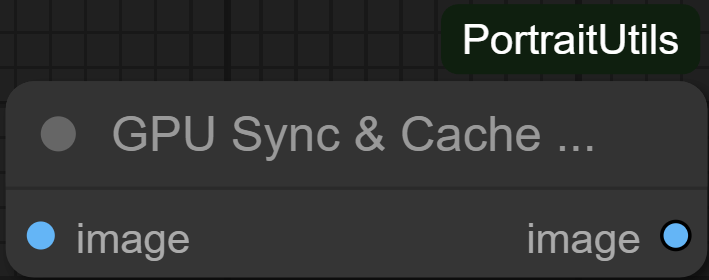

# GpuSyncCacheClear

## Overview
`GpuSyncCacheClear` is a utility node that forces a CUDA synchronisation, runs Python garbage collection, and empties the CUDA memory cache before passing the input image through untouched. It can help stabilise lengthy workflows by periodically freeing cached allocations.

## Inputs
- `image` (`IMAGE`): Any image tensor. The node does not modify the data.

## Outputs
- `image` (`IMAGE`): The same tensor received as input.

## Processing Notes
- CUDA synchronisation and cache clearing are wrapped in `try/except` blocks so the node is safe to use on CPU-only systems or when CUDA is unavailable.
- Python’s garbage collector runs every time the node executes, which can slightly increase runtime but helps reclaim CPU memory between large steps.

## Tips
- Insert this node between GPU-intensive stages (e.g., after diffusion sampling) to free VRAM before loading another model.
- Because the node simply echoes its input, it can sit inline without altering workflow semantics.*** End Patch
