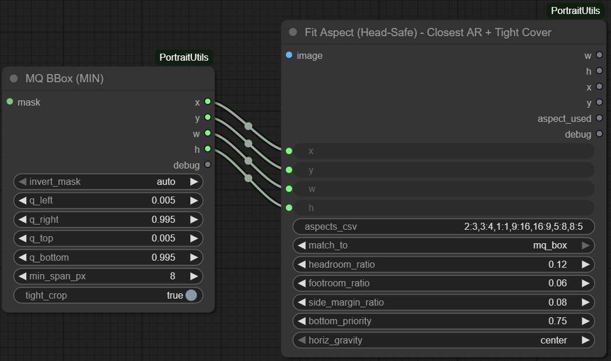

# MQBBoxMin

## Overview
`MQBBoxMin` (Median/Quantile Bounding Box) derives a robust subject bounding box from a mask. It auto-detects whether the mask represents foreground or background, applies quantile-based trimming to ignore outliers, and optionally inflates the result to maintain a minimum span. The node returns both the bounding box and a debug string describing the decision path.

## Inputs
- `mask` (`MASK`): Input tensor in any common mask layout; converted to a 2D float array internally.
- `invert_mask` (`STRING`, default `"auto"`): Controls which side of the mask is treated as foreground. `"auto"` picks the side with less border mass, `"false"` keeps the mask as-is, `"true"` inverts it.
- `q_left`, `q_right`, `q_top`, `q_bottom` (`FLOAT`, defaults `0.005` / `0.995`): Quantiles used to crop the subject along each axis. Lower values trim only extreme borders; higher values create tighter boxes.
- `min_span_px` (`INT`, default `8`): Minimum width/height enforced after quantile cropping.
- `tight_crop` (`BOOLEAN`, default `False`): When `False`, the node simply returns the full image bounds. When `True`, the node creates a tight bounding box around the subject with safety margins and crops to the tightest legal resolution, effectively cropping out dead space in the image.

## Outputs
- `x`, `y`, `w`, `h` (`INT`): Bounding box coordinates in pixels relative to the mask.
- `debug` (`STRING`): Notes on the foreground selection, quantile bounds, and any aspect-ratio adjustments.

## Processing Notes
- The mask is normalised to `[0, 1]`, with automatic conversion from 8-bit values when necessary.
- Quantile bounds are computed using cumulative sums along rows and columns, ensuring consistent behaviour even for noisy masks.
- The routine grows the quantile box by a padding proportional to image size and then searches for the minimal-area rectangle matching the image aspect ratio. Additional candidate aspect ratios (1:1, 2:3, 3:4, 9:16, etc.) are evaluated to minimise area.
- If a suitable aspect container cannot be found, the raw quantile rectangle is returned.

## Tips
- Feed the output directly into `FitAspectHeadSafe` to generate camera-friendly crops.
- Raise `min_span_px` when working with thin subject masks to avoid degenerate boxes.
- For masks that include the background (white is background, black is subject), set `invert_mask` to `"true"` instead of relying on `"auto"`.*** End Patch
